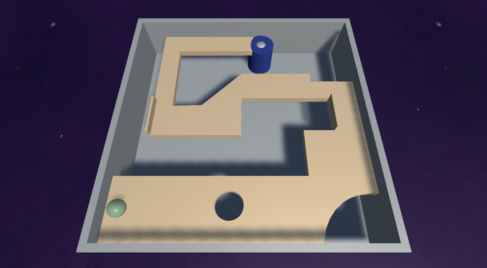

# Keep Rolling, Ball

[Play it on itch.io](https://honeymead.itch.io/keep-rolling-ball).

## About

A unity 3D game where you have to roll a ball on a board through a labyrinth without it falling into holes.
It is pretty common but I do not known how it is called.

## How to add a level

1. Go to _Assets\Scenes_ and duplicate a scene.
2. Put a new fbx file into _Assets\Board_.
3. In the BoardBox of the scene replace the Board *mesh* with the new one.
4. Remove and re-add the mesh collider.
5. Move the goal to the correct position.
6. Add the scene in the build settings.
